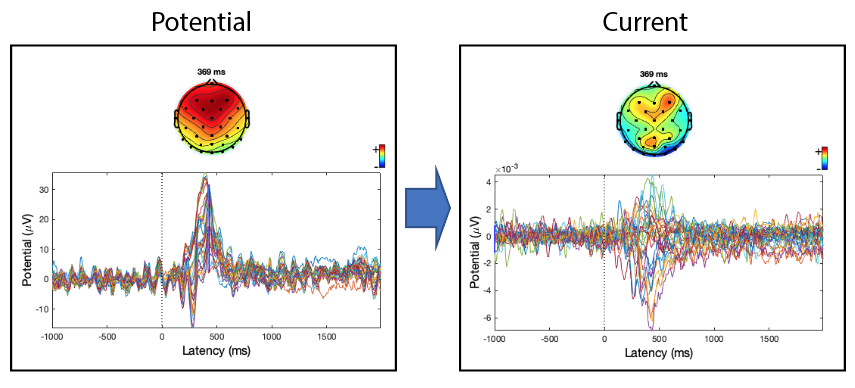

The SCD plugin allows computing scalp current density (also sometimes referred to as surface Laplacian) using different methods finite-difference method, spherical spline method, and Hjorth approximation. An EEG topography's sign is directly related to the radial current directions underlying it. Positive values represent the current flow from the brain towards the scalp (called sources), and negative values representing current flow from the scalp to the brain. SDC estimates have a sharper topography, effectively reducing the negative impact of volume conduction. The plugin allows replacing the EEG data with the SCD transformation and using all EEGLAB functions on the SCD estimates, including group analysis. The plugin leverages the ft_scalpcurrentdensity function of Fieldtrip and has been tested against the eeg_laplac.m function of EEGLAB (command line only). 

Version history
---------------
V1.0 - Initial version
